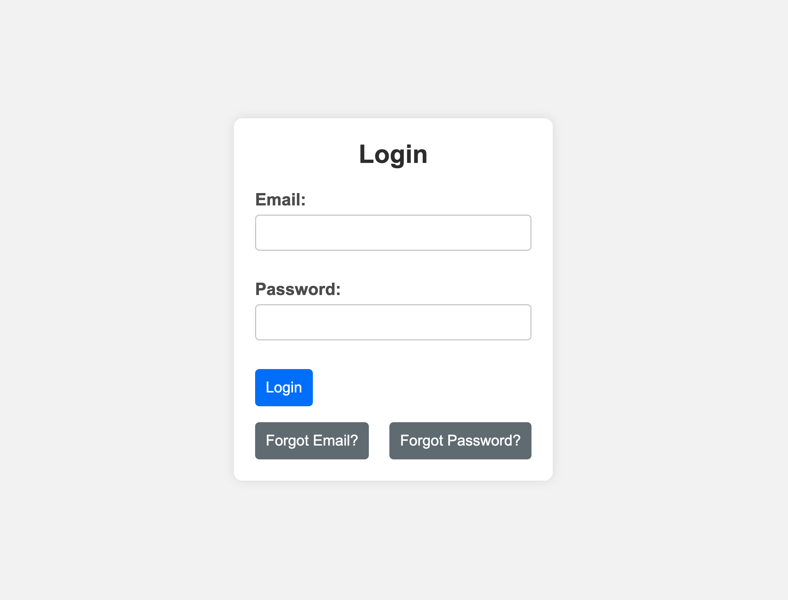

# Create and Style a Login Form with the help of AI

### Here is an example of what you could create.


## Description 📄
In this assignment, you will create and style a modern login form with the help of AI. The focus will be on structuring the HTML and applying CSS for a polished, responsive design.

This activity is meant to be done solo. As such your result may look slightly different than another classmate or the solution. That is fine as there are countless ways to complete this. Use documentation, AI, your instructor or  associate for help as needed.
Customize the styles and form content as you like. 
Make it your own!

##

## Project Structure

In this assignment, you are provided with the following file structure:

```
LoginForm/
├── index.html
└── styles.css
```

# Instructions ✅

## 1. **Create the Project Folder and Files**
   - [ ] Create a folder named `LoginForm` to store all your project files.
   
   - [ ] Inside the `LoginForm` folder, create a file named `index.html`. This will be your main HTML file.
   
   - [ ] Also, in the `LoginForm` folder, create another file named `styles.css`. This file will contain the CSS used to style your HTML content.


## 2. **Build a Basic HTML Boilerplate**
Begin by building the foundation of your webpage using an HTML boilerplate. Need assistance? Just ask AI!

- [ ] Create the boilerplate for your HTML project.

- [ ] Linking your CSS file while building out the boilerplate structure. 

- [ ] Paste your code into your empty `index.html` file.

**Explanation:**
- Declares the document as HTML5 and sets up the essential metadata and styles.

## 3. **Create the Login Form Structure** 
Next, add the HTML elements needed for a login form, such as input fields for a username and password. 

- [ ] Ask AI: "How do I structure a basic login form in HTML? 

- [ ] Determine what fields belong in your signup form (name, age, email, etc) and look up how to create those `inputs`.

- [ ] Determine where to insert the login form code within your HTML boilerplate.

**Explanation:**
- We're using AI to help structure and build a simple login form in HTML by providing guidance on field selection.

## 3. **Now let's test our unstyled code for our basic login form**

- [ ] Open the index.html file in your browser to view your login form as it currently appears.

##

**Explanation:**
- You should see a page resembling the screenshot below.


##

 ### Let's add some CSS styling!

 Keep in mind that when asking AI for help with styling, you may need to supply your `HTML` code so it knows which classes or IDs you may have used.

## 4. **Apply CSS styling to the form.**
Once you have all your `HTML` code in place you should be ready to move on to styling the form.

- [ ] Ask AI for help styling the login form. You could say: "How can I style the container to center a login form on the page?". Try giving it the code you already have and asking it to generate the style for it.

**Explanation:**
- We used AI to guide us in applying a CSS Reset, centering the login form, and styling the input fields and buttons for a cohesive and consistent design.

## 5. **Testing Your Project**
Now, let's see how your styled project is coming along.

- [ ] Open your `index.html` file in a web browser.

- [ ] Verify that the login form is centered on the page and that all elements are styled correctly.

- [ ] Customize the styles and form content as you like with the assistance of AI if needed.

- [ ] Look through all your code and ask AI to explain anything you do not understand in both the `html` and `css` files.

- [ ] Ask for AI help (if needed) to change colors and styles throughout your form. Make it your own. 

**Explanation:**
- In this step, you'll test your project by opening it in a browser to ensure the login form is centered and styled correctly. 

## 

**Conclusion**

By completing this project, you should have learned how to structure a simple HTML form and style it using CSS. You also learned how to effectively use AI to assist in your coding process. Remember that AI is a tool and it is up to you to make sure you understand what it generates and why. This will help you grow as a developer.

##

### Solution codebase 👀
🛑 **Only use this as a reference** 🛑

💾 **Not something to copy and paste** 💾

**Note:**  This lab references a solution file located [here](https://github.com/HackerUSA-CE/aisd-wde-03-styling-a-form/tree/solution) (link not shown).

---

© All rights reserved to ThriveDX

